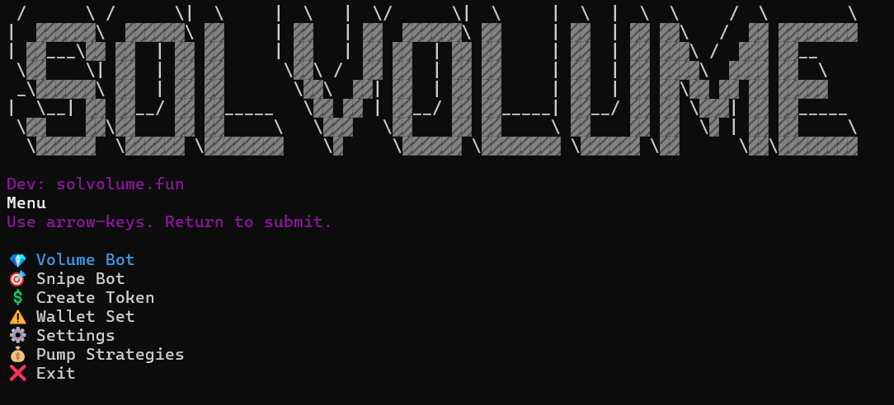

<h1  align="center"> Solana Copy Trading Bot by SolVolume👽 </h1>
SolVolume is the best AIO-bot which includes Solana copy-trading, Parser/Analyzer Wallets, Tracker Wallets, Solana Volume, Solana Bump, Solana Sniper, MEV-bot.

# Parser/Analyzer Wallets

- Ability to parse migrated contracts.  
- Ability to parse an unlimited number of wallets from an unlimited number of contracts.  
- A vast number of filters (settings) for the parser.  
- Automatic creation of an Excel table for monitoring.

# Tracker Wallets
- It is designed to track all transactions of wallets that you are copying, with a user-friendly interface and the most detailed information about each trade.

# ABOUT

**SolVolume** -  designed to automate trading strategies on the Solana blockchain using the Raydium/PUMP.FUN/MOONSHOT
Built by traders for traders.

We've closely observed the shift in trading activity from Ethereum to Solana. After months of quiet development, we're proud to introduce **SolVolumeBot** — a powerful tool designed to elevate your trading strategy on Solana.

# V1.2.7 Features

1. `💎 Volume Bot` *creates natural trading activity for your token by allowing you to set SOL purchase ranges and delays between buys.*
2. `🎯 Snipe Bot` *utilizes sub wallets for mass purchasing of existing tokens before Community Take Over (CTO) and monitors new tokens minted by specific wallets for quick acquisition.*
3. `💲 Create Token` *flexible Token Bundler facilitates token launches on PUMP.FUN and Raydium, offering manual wallet allocation, dynamic SOL distribution, and sniper protection.*
4. `⚠️ Wallet Set` *Each set includes a Master Wallet and multiple Sub Wallets with customizable settings for fees, priority fees, slippage, and other parameters. Manage balances by viewing balances, private keys, and performing low-fee fund and withdrawal operations.*
5. `📊Liquidity Management` *Liquidity Pool Creation and Removal: Now supports the creation and management of liquidity pools on Raydium or Orca platforms*
6. `🔄 Market-Making & Trading Bots` *Swap and Bulk Swap Tools: Users can now perform swaps or bulk swaps for tokens, crucial for executing market-making strategies.
Market-Making Bots: Introduced bots designed to assist in market-making, ensuring liquidity and tighter spreads in trading activities.*
7. `📦 Batch Operations` *Batch Wallet Creation: Introduced a tool for generating multiple wallets simultaneously, ideal for large-scale operations.
Batch Transfers: Implemented batch transfer capabilities, allowing efficient token distribution from one source to multiple destinations.*
8. `💰 Pump Strategies` *Pump Coordination Tools: Enhanced pump strategies with tools for opening pumps, managing trades, and even engaging in micro trading within the pump ecosystem.*
9. `📜 Convenient Tools` *Token Snapshot: Added a tool for taking snapshots of token holdings at specific block heights, useful for airdrops or governance.
WSOL Exchange: Provided an easy way to wrap or unwrap SOL (WSOL), facilitating interactions with various Solana-based decentralized applications.*
10. `⚙️ Settings` *Update default configurations for each bot, including changing language, updating software, and viewing logs.*

## ✅ We provide 1-hour trial of our bot for free!✅

### TRIAL VERSION:
1. `Go to the site and click FREE TRIAL to get a key to activate the bot. `
2. `Copy this key and click TAKE ADVANTAGE`
3. `Insert the key into the window that appears and download the bot`

> [!TIP] 
> If you have problems to understand all of this, [write to us](https://t.me/SolVolSupp_bot)!
